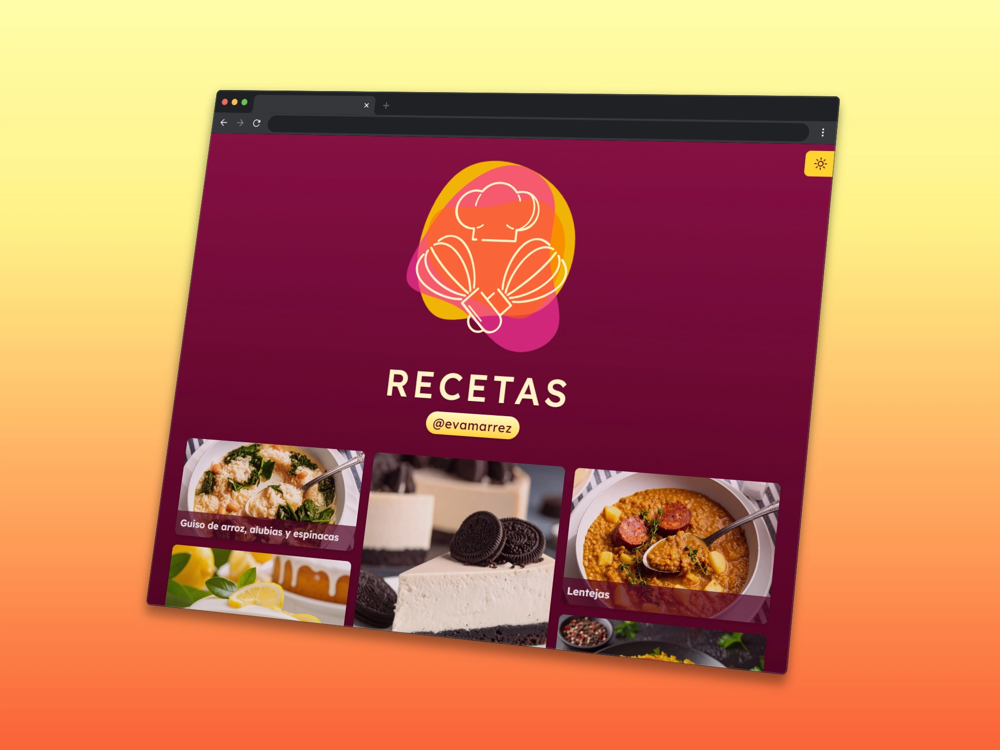

# Eva Marrez - Recetas 🍽️

Este proyecto es una pequeña página creada con [Astro](https://astro.build) y [Tailwind CSS](https://tailwindcss.com) para mostrar mis recetas favoritas de forma simple, rápida y accesible desde cualquier dispositivo.

## 🔗 URL del sitio

Puedes visitar la web en producción aquí:  
➡️ **[https://evamarrez.com/recetas](https://evamarrez.com/recetas)**

## 🛠 Tecnologías utilizadas

- [Astro](https://astro.build): framework moderno para sitios estáticos.
- [Tailwind CSS](https://tailwindcss.com): utilidad para estilos rápidos y personalizables.
- [Markdown](https://www.markdownguide.org/): cada receta está escrita en archivos `.md` para una fácil edición y mantenimiento.

## 📝 Licencia

Este proyecto es de uso personal y sin fines comerciales.

---

¡Gracias por visitar y buen provecho! 😋